# Position Template ER Diagram

The schema below is extracted from the live `cmd-position-template-service` database and augmented with the planned `isUsed` flag for positions. Relationships focus on the entities exposed by the position template APIs.

```mermaid
erDiagram
    Position ||--o{ PositionName : "has translations"
    Position ||--o{ PositionTag : "tagged by"
    Position ||--o{ File : "has attachments"
    Position ||--|| PositionStyle : "styled by"
    Position }o--o{ Position : "parent-child"
    Position ||--|| PositionTitle : "title detail"
    PositionTitle ||--o{ PositionTitleQuestionText : "question texts"
    Position ||--|| PositionOutline : "outline detail"
    Position ||--|| PositionSummary : "summary detail"
    Position ||--|| PositionAsset : "asset detail"
    Position ||--|| PositionFlow : "flow detail"
    Position ||--|| PositionQualitative : "qualitative detail"
    PositionQualitative ||--o{ PositionQualitativeOptions : "options"
    PositionQualitativeOptions ||--o{ PositionQualitativeOptionLabels : "labels"
    PositionQualitative ||--o{ PositionQualitativeTextOfQuestion : "question text"
    Position ||--|| PositionIndicator : "indicator detail"
    PositionIndicator ||--o{ IndicatorPositionRef : "position refs"
    PositionIndicator ||--o{ IndicatorImpactRef : "impact refs"

    Position {
        UUID id PK
        UUID tenantId
        POSITION_TYPE type
        UUID parentId FK
        INT sortingLevel
        VARCHAR code
        TIMESTAMP startTerm
        TIMESTAMP endTerm
        BOOLEAN isActive
        BOOLEAN isUsed "planned flag for usage gating"
        TEXT description
        TEXT createdBy
        TIMESTAMP createdAt
        TEXT updatedBy
        TIMESTAMP updatedAt
        TIMESTAMP deletedAt
        UUID styleId FK
        TIMESTAMP closeDate
    }

    PositionName {
        UUID id PK
        UUID positionId FK
        TEXT locale
        VARCHAR text
        TIMESTAMP createdAt
        TIMESTAMP updatedAt
        TIMESTAMP deletedAt
    }

    PositionTag {
        UUID id PK
        UUID positionId FK
        TEXT tagId
        TIMESTAMP createdAt
        TIMESTAMP updatedAt
        TIMESTAMP deletedAt
    }

    PositionStyle {
        UUID id PK
        TEXT name
        TEXT value
        TIMESTAMP createdAt
        TIMESTAMP updatedAt
        TIMESTAMP deletedAt
    }

    File {
        UUID id PK
        UUID tenantId
        UUID positionId FK
        TEXT storageKey
        TEXT fileName
        TEXT mimeType
        BIGINT sizeBytes
        TEXT uploadedBy
        TIMESTAMP uploadedAt
        TIMESTAMP deletedAt
    }

    PositionTitle {
        UUID positionId PK
        TIMESTAMP createdAt
        TIMESTAMP updatedAt
        TIMESTAMP deletedAt
    }

    PositionTitleQuestionText {
        UUID id PK
        UUID positionId FK
        TEXT locale
        VARCHAR text
        TIMESTAMP createdAt
        TIMESTAMP updatedAt
        TIMESTAMP deletedAt
    }

    PositionOutline {
        UUID positionId PK
        BOOLEAN useInReport
        TIMESTAMP createdAt
        TIMESTAMP updatedAt
        TIMESTAMP deletedAt
    }

    PositionSummary {
        UUID positionId PK
        TEXT quantityId
        BOOLEAN useInReport
        TIMESTAMP createdAt
        TIMESTAMP updatedAt
        TIMESTAMP deletedAt
    }

    PositionAsset {
        UUID positionId PK
        TEXT quantityId
        NUMERIC allowedDeviationPercent
        BOOLEAN requireComment
        BOOLEAN priority
        BOOLEAN overviewAggregation
        BOOLEAN previousValue
        BOOLEAN useInReport
        TIMESTAMP createdAt
        TIMESTAMP updatedAt
        TIMESTAMP deletedAt
    }

    PositionFlow {
        UUID positionId PK
        TEXT quantityId
        NUMERIC allowedDeviationPercent
        BOOLEAN requireComment
        BOOLEAN priority
        BOOLEAN overviewAggregation
        BOOLEAN previousValue
        BOOLEAN useInReport
        TIMESTAMP createdAt
        TIMESTAMP updatedAt
        TIMESTAMP deletedAt
    }

    PositionQualitative {
        UUID positionId PK
        POSITION_QUALITATIVE_CHOICE choiceOfAnswer
        BOOLEAN textRequiredAnswer
        INT minSelected
        INT maxSelected
        BOOLEAN useInReport
        BOOLEAN priority
        TIMESTAMP createdAt
        TIMESTAMP updatedAt
        TIMESTAMP deletedAt
    }

    PositionQualitativeOptions {
        UUID id PK
        UUID qualitativeId FK
        INT seq
        NUMERIC weight
        BOOLEAN requireCommentOnFillout
        TIMESTAMP createdAt
        TIMESTAMP updatedAt
        TIMESTAMP deletedAt
    }

    PositionQualitativeOptionLabels {
        UUID id PK
        UUID optionId FK
        TEXT locale
        TEXT text
        TIMESTAMP createdAt
        TIMESTAMP updatedAt
        TIMESTAMP deletedAt
    }

    PositionQualitativeTextOfQuestion {
        UUID id PK
        UUID positionId FK
        TEXT locale
        VARCHAR text
        TIMESTAMP createdAt
        TIMESTAMP updatedAt
        TIMESTAMP deletedAt
    }

    PositionIndicator {
        UUID positionId PK
        TEXT quantityId
        INDICATOR_INTERVAL aggregationInterval
        INDICATOR_CALCULATION calculation
        TEXT formulaRaw
        JSONB formulaTokens
        BOOLEAN useInReport
        TIMESTAMP createdAt
        TIMESTAMP updatedAt
        TIMESTAMP deletedAt
    }

    IndicatorPositionRef {
        UUID positionId FK
        UUID refPositionId FK
        TEXT refCode
        TEXT refLabel
        TIMESTAMP createdAt
    }

    IndicatorImpactRef {
        UUID positionId FK
        TEXT impactId
        TEXT impactCode
        TEXT impactLabel
        TIMESTAMP createdAt
    }
```

